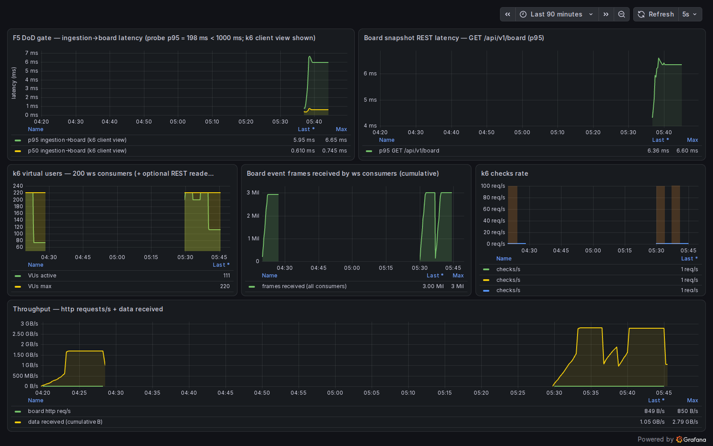
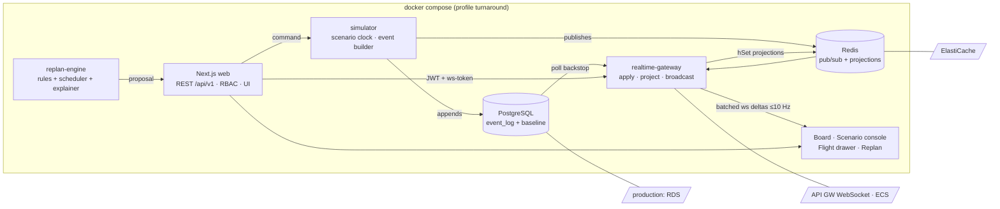

# Aviation Portfolio — Singapore

[](https://github.com/ricothenfx/aviation/actions/workflows/ci.yml)
[](https://github.com/ricothenfx/aviation/actions/workflows/e2e.yml)

A portfolio of 3 aviation-domain software projects built to demonstrate senior full-stack
engineering (TypeScript / Next.js) with applied AI, targeting software engineering roles at
Singapore aviation companies.

> **All data in every project is simulated for portfolio purposes.** No affiliation with any
> real company is claimed or implied. See `docs/02-standards/data-ethics.md`.

## 1 — turnaround-iq: AI-assisted aircraft turnaround command center ✅

**For the engineering reviewer:** an event-sourced turnaround board. A deterministic scenario
simulator appends domain events to PostgreSQL; a realtime gateway projects them into Redis and
broadcasts deltas over WebSocket (≤10 Hz per client, batched per flush); a constraint scheduler
re-sequences ground tasks on disruption; the LLM only *explains* the proposed plan — humans
approve it. Full audit trail per flight, RBAC (viewer/coordinator/supervisor), versioned REST +
WS contracts, Prometheus/Grafana evidence dashboard.

**For the aviation domain reader:** every aircraft turnaround is a race against departure time.
When a baggage loader breaks down, today the coordinator finds out late and re-plans by hand.
turnaround-iq raises the alert 10+ minutes before the SLA breaches, proposes a re-sequenced plan
that cuts a 47-minute delay to 9, and keeps the human in charge of approving it — with the full
"why was this flight late" trail auditors ask for.

| | |
|---|---|
|  | *Live board: simulated day ticking, loader-breakdown injected, alert raised, AI replan approved. All data synthetic.* |

### Measured, not claimed (F5 load gate — [full report](docs/04-projects/turnaround-iq/load-report-f5.md))

At **10× scenario scale** (600 flights, 15,000 events replayed at ~100 events/s) with **200
concurrent WebSocket consumers**:

| Metric | Result | Target |
|---|---|---|
| Ingestion → board p95 | **198 ms** | < 1 s ✓ |
| Frame delivery | **100.0%** (3,000,000 / 3,000,000) | — |
| Reproducible | committed k6 scenario + probe + manifest | — |



### Architecture



Every local component maps 1:1 to its AWS production analog — the locked deploy-shape decision
([tech-stack.md §2](docs/03-platform/tech-stack.md)). Note: the LLM integration is
**Bedrock-compatible by shape** (ADR-0003); it runs against a deterministic mock by default and
is not an AWS deployment.

### Mapped to JD requirements

Source: [CAG Senior Software Engineer Req 7075](docs/00-context/target-roles.md) — full evidence
table in [traceability-matrix.md](docs/00-context/traceability-matrix.md).

| JD requirement (Req 7075) | Evidence in this repo |
|---|---|
| TypeScript, production quality | strict `tsc --noEmit` gate, zero-warning lint, 68 unit tests |
| Next.js full-stack | board UI + versioned `/api/v1` REST (auth, board, events, scenarios, replans, explanation) |
| Tailwind CSS responsive UI | token-driven design system (`packages/ui`), 1280×720 + 768×1024 visual smoke |
| Document-based data models | replan proposals + task config as JSONB documents (ADR-0002 divergence note) |
| Git workflows | conventional commits, one logical change each, reviewed history as deliverable |
| REST API design/integration | zod contracts, error envelope, idempotency keys, WS protocol (api-contracts.md) |
| Docker containerisation | compose profiles, production images + runbook (`infra/deploy/`) |
| AuthN/AuthZ | JWT sessions, 3 roles, server-side RBAC matrix tested |
| AWS — deploy, operate, integrate | AWS-native service mapping + IaC-ready deploy config (tech-stack.md §2) |
| CI/CD, testing, logging, monitoring | GitHub Actions (unit · integration · e2e · compose smoke · benchmarks), JSON logs, Grafana evidence dashboard |
| Discovery → prototyping → production ownership | PRD → 5 milestones → ×10 load gate with honest findings |

## Projects (build order locked — D-02)

| # | Project | Status | Spec |
|---|---|---|---|
| 1 | **turnaround-iq** — AI-assisted aircraft turnaround command center | **F5 complete** (milestones F1–F5) | `docs/04-projects/turnaround-iq/` |
| 2 | **mro-copilot** — maintenance-manual RAG copilot + engine health | spec pending | `docs/04-projects/mro-copilot/PRD.md` |
| 3 | **rebook-ai** — passenger disruption concierge | spec pending | `docs/04-projects/rebook-ai/PRD.md` |

## Quickstart (turnaround-iq)

Prerequisites: Node 22 (`.nvmrc`), corepack pnpm 9, Docker with Compose v2.

```bash
pnpm install                                   # install workspace dependencies
pnpm dev                                       # postgres+redis (compose) + Next dev on :3000
```

The first run needs the schema and demo users:

```bash
pnpm seed                                      # migrations + reference day + seeded demo users
```

Sign in on http://localhost:3000 with a seeded account, e.g. coordinator
`maya.tan@nx-sim.example` / `coordinator-nx-01` (all accounts are fictional demo data).
Supervisor (scenario start/reset + speed control + disruption inject):
`priya.nair@nx-sim.example` / `supervisor-nx-01`.

Full containerized mode (no host Node needed at runtime) — postgres + redis + web on
**http://localhost:3001**, plus the simulator (scenario clock → event log), the
realtime gateway (projection worker + ws on **ws://localhost:4001/api/ws**) and the
replan engine; containers install, seed and serve by themselves:

```bash
docker compose --profile turnaround up -d
docker compose --profile turnaround down -v
```

Start the reference scenario (supervisor) from the board's scenario console, or via REST:
`POST /api/v1/scenarios/reference-day/start {"speed": 20}` — the board then updates live
over WebSocket from the event-sourced ground-task log.

All operational data is simulated (see `docs/02-standards/data-ethics.md`); every screen
carries the disclaimer. For host-side runs, copy `.env.example` to `.env` and set a real
`AUTH_SECRET` (`openssl rand -base64 32`).

## Load & observability

```bash
docker compose --profile evidence up -d        # Prometheus + Grafana (loopback :9090/:3002)
pnpm loadtest                                  # ×10 scale gate: k6 200 consumers + latency probe
pnpm loadtest -- --prom                        # same, feeding the Grafana dashboard
pnpm bench:replan                              # replanner benchmark: 47 → ≤ 9 min in < 2 s
```

Full numbers, methodology and the failures found on the way:
[load-report-f5.md](docs/04-projects/turnaround-iq/load-report-f5.md).

## Documentation Map

| Path | Contains |
|---|---|
| `AGENTS.md` | Working rules for coding agents (read this first) |
| `docs/00-context/` | Market research, target JDs, requirement traceability |
| `docs/01-decisions/` | Decision log (binding) + ADRs 0001–0008 |
| `docs/02-standards/` | Engineering, UI design system, data ethics |
| `docs/03-platform/` | Monorepo layout, locked tech stack |
| `docs/04-projects/turnaround-iq/` | PRD, architecture, contracts, milestones, demo script, load report |

## Commands

```bash
pnpm dev                 # infra (compose profile "infra") + Next dev server on :3000
pnpm build               # build packages (tsup) + apps (next build)
pnpm lint                # prettier --check + eslint (zero warnings)
pnpm typecheck           # tsc --noEmit strict across the workspace
pnpm test                # vitest unit tests across the workspace (no DB)
pnpm test:integration    # vitest integration tests against the compose stack
pnpm test:e2e            # Playwright e2e (needs compose stack)
pnpm loadtest            # ×10 load gate (k6 + 200 ws consumers + latency probe)
pnpm bench:replan        # replanner benchmark
pnpm seed                # apply migrations + reference day + seeded demo users
pnpm db:generate         # drizzle-kit generate migration SQL
pnpm db:migrate          # apply pending migrations
```

CI (`.github/workflows/ci.yml`) runs lint → typecheck → unit → build, plus a
compose-stack job that boots the full `turnaround` profile (postgres · redis · web ·
simulator · realtime-gateway), logs in as a seeded coordinator, runs the integration
suite (ADR-0001 golden replay, idempotency, worker latency, RBAC matrix), the
board-latency benchmark (p95 < 1 s target) and the replanner benchmark on every push/PR.
The e2e workflow drives the real UI (board → inject → replan → approve) with visual
smoke at two viewports.

## Deployment

**Live demo: <https://turnaround-iq.aviation.ricothen.com>** — deployed 2026-09-24
on a single VPS; sign in with a seeded account, e.g. coordinator
`maya.tan@nx-sim.example` / `coordinator-nx-01` (fictional demo accounts; all
data simulated).

Production structure lives in [`infra/deploy/`](infra/deploy/README.md): production
images, `compose.prod.yml` (same six services behind Caddy with automatic TLS), and a
runbook with rollback (ADR-0006; the AWS-native mapping in
[tech-stack.md §2](docs/03-platform/tech-stack.md) remains the cloud narrative).

## Evidence & Traceability

Every feature traces to a real Singapore job requirement:
`docs/00-context/traceability-matrix.md` (JD requirement → feature → code → test).
