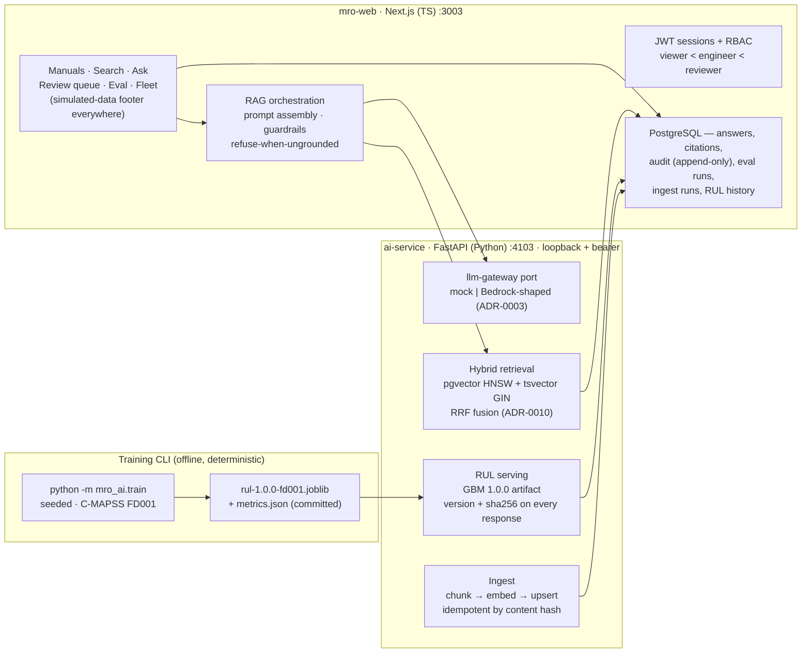

# MRO Copilot

**Ask the manual. Cite the page. Refuse when ungrounded. Sign off before it reaches the floor.**

MRO Copilot is a maintenance-manual RAG copilot for the fictional **NX-320** fleet:
every answer carries chunk-level citations (document · section · page · revision),
the copilot **refuses explicitly** when the corpus cannot ground a reply, and nothing
unverified ships — a reviewer signs off every drafted answer into a verified library.
A second surface predicts engine removals from NASA's public **C-MAPSS** dataset, with
per-unit trends and maintenance-window alerts.

> **Simulated data for portfolio purposes.** The manual corpus is hand-written fiction
> (NX-320), the fleet is synthetic, and all data on every screen is labeled as
> simulated. See [What is simulated](#what-is-simulated).

Built as the second project of an aviation-software portfolio
([repo overview](../../AGENTS.md)) — **two audiences, one codebase**: it works as an
engineer's tool (browse → search → ask → verify) and as a readable, honest
demonstration of production-shaped AI engineering for hiring reviewers.

---

## The problem it demonstrates

Under AOG pressure, MRO engineers hunt procedures across 10k+ page manuals. Generic
LLMs make this *worse*, not better: an invented torque value or step sequence is
dangerous. The defenses that make LLMs usable in maintenance are exactly what this
project implements and measures:

1. **Grounded retrieval** — hybrid pgvector + lexical search fused by RRF, revision-aware
   (superseded content is excluded by default, searchable explicitly).
2. **Citation validity, enforced in code** — every citation must resolve to a chunk
   actually retrieved for that answer; asserted at 100% by the eval.
3. **Refuse-when-ungrounded** — below the calibrated grounding threshold the copilot
   returns an explicit refusal with a machine-readable reason and *no answer text*.
4. **Human-in-the-loop sign-off** — `draft → approved | rejected`, reviewer-only,
   self-approval blocked, append-only audit; approved answers form a verified library.
5. **Honest evaluation** — golden-QA and refusal fixtures are versioned, gated in CI,
   and bad runs are reported next to good ones.

## Architecture

Two runtimes by decision ([ADR-0012](../../01-decisions/adr/ADR-0012-mro-ai-service-topology.md)):
the **Next.js app** owns product logic (auth, RBAC, RAG orchestration, guardrails,
sign-off, audit); the **Python ai-service** owns embeddings, retrieval SQL and RUL
inference, and is internal-only (bearer token, loopback).



**Trade-off story (each link is a decision, not a vibe):**

- **pgvector, not a vector DB** — [ADR-0010](../../01-decisions/adr/ADR-0010-pgvector-vector-store.md):
  one engine, one migration tool, transactional ingest; HNSW + GIN in the same query
  as metadata filters. Scale ceiling (~10M chunks) documented, revisit via ADR.
- **Deterministic GBM, not LSTM** — [ADR-0011](../../01-decisions/adr/ADR-0011-rul-model-choice.md):
  a few RMSE points traded for same-seed byte-identical artifacts and honest baselines
  ([model card](#model-card)); deep models stay one ADR away.
- **Two runtimes, split by ownership** — [ADR-0012](../../01-decisions/adr/ADR-0012-mro-ai-service-topology.md):
  AI-serving in Python (locked stack, D-03), product domain logic in TS; interface
  parity asserted by cross-runtime contract fixtures.
- **Provider-agnostic LLM gateway with a deterministic mock** — [ADR-0003](../../01-decisions/adr/ADR-0003-llm-gateway.md),
  ported to Python by ADR-0012: demos are offline-safe and cost-zero; `source` and
  `provider` are disclosed on every answer (`llm` / `extractive` / `none`).
- **Bounded retrieval connection pool** — [ADR-0013](../../01-decisions/adr/ADR-0013-retrieval-connection-pool.md):
  found by the F5 load runs (single-connection serialization capped throughput),
  fixed with psycopg stdlib only.

## Feature status (F1–F5 done)

| Area | What works | Evidence |
|---|---|---|
| Manual library | 62 fictional NX-320 docs (AMM/IPC/TSM/SB), ATA structure, revisions, supersession, 630 chunks | `seed/manuals/`, corpus tests |
| Hybrid search | pgvector + tsvector RRF, filters, lexical degradation ladder | `pnpm eval:mro` (recall@5 **0.9231**), search contract tests |
| RAG copilot | grounded answers, page-level citations, calibrated refusal, source/provider disclosure | `pnpm eval:mro:full` (refusal **100%**, citation validity **100%**, grounded **84.6%**) |
| Sign-off | reviewer approve/reject with note, self-approval blocked, append-only audit, verified library | integration + e2e specs |
| Engine health | C-MAPSS FD001-trained GBM (RMSE **18.49**, NASA 786.5), fleet tiles, trend ±1.96σ band, alert lifecycle with strict `raised → acknowledged → resolved` | `models/metrics.json`, [final eval report](../../04-projects/mro-copilot/final-eval-report-f5.md) |
| Eval harness | versioned golden-QA (52) + refusal (22) fixtures, CI-gated, reviewer dashboard | `eval-reports/`, `GET /api/v1/evals` |
| Load evidence | k6 + independent probe harness; ask gate verified within a stated host-load envelope; search 100-VU documented honestly as host-limited | [load report](../../04-projects/mro-copilot/load-report-f5.md) |

Consolidated numbers: [final-eval-report-f5.md](../../04-projects/mro-copilot/final-eval-report-f5.md).

## Model card (summary)

| | |
|---|---|
| Model | `HistGradientBoostingRegressor` on windowed C-MAPSS FD001 features, piecewise-linear RUL (clip 125), seed 42 ([ADR-0011](../../01-decisions/adr/ADR-0011-rul-model-choice.md)) |
| Artifact | `services/mro-copilot/ai-service/models/rul-1.0.0-fd001.joblib` · sha256 `f612eb43…902a23`, verified at load; every response carries `modelVersion` + `modelSha256` |
| Metrics | FD001 test RMSE **18.49** (≤ 24 gate), NASA score 786.5, MAE 13.98; uncertainty band ±1.96σ (homoscedastic, stated) |
| Reproducibility | same seed ⇒ byte-identical artifact (CI-tested); training via pinned CLI: `python -m mro_ai.train --dataset fd001` |
| Honest limits | trails tuned deep models (LSTM 16.14, DCNN 12.61 — see baselines in metrics.json); no drift monitoring (PRD OUT-of-scope); serving dataset is the C-MAPSS-derived seeded fleet, labeled synthetic in the UI |
| Intended use | portfolio demonstration of versioned, provenance-carrying RUL serving — **not** a production prognostics system |

## JD mapping (CAG Req 7133 / Req 7167)

| Requirement | Where it lives |
|---|---|
| RAG + grounding (7133) | hybrid retrieval (ADR-0010) + citation validity invariant (api-contracts §4), eval-asserted at 100% |
| LLM integration, provider-agnostic (7133) | `packages/llm-gateway` + Python port (ADR-0003/0012), mock + Bedrock-shape |
| Guardrails + validation (7133) | calibrated grounding threshold, refusal with machine-readable reason, refusal integrity tests (FR-10) |
| Evaluation (7133) | versioned golden-QA/refusal fixtures, CI gates, persisted run history (`GET /api/v1/evals`) |
| Human-in-the-loop (7133) | sign-off lifecycle with separation of duties + append-only audit (FR-14) |
| Prompt design (7133) | prompt assembly constrained to retrieved chunks with page/revision metadata (`src/lib/rag/engine.ts`) |
| Observability / reliability (7133) | `/healthz` `/readyz` dependency reports on both services, structured request logs, degradation ladder (`mode: "lexical"`), failure envelopes with requestIds |
| REST + auth (7133) | `/api/v1` contracts, JWT sessions, RBAC ladder, idempotency keys (FR-1/FR-2) |
| CI/CD (7133/7167) | GitHub Actions: lint/typecheck/unit per runtime, compose smoke + integration, eval gates, Playwright e2e |
| Model versioning / MLOps shape (7167) | seeded training CLI, semver + sha256 artifact pinning, committed metrics.json, artifact-hash verification at load |
| scikit-learn / classical ML (7167) | GBM RUL model with published-baseline comparison (D-07 honesty) |
| Containerized serving (7167) | compose profile `mro`, loopback-only ai-service, health-gated deploys |

Divergences from the letter of the JDs (e.g. no LangChain, PyTorch absent) are
decisions with ADRs: [ADR-0011](../../01-decisions/adr/ADR-0011-rul-model-choice.md),
[ADR-0012](../../01-decisions/adr/ADR-0012-mro-ai-service-topology.md).

## What is simulated

Binding rules: [data-ethics.md](../../02-standards/data-ethics.md) and D-07.

- **NX-320 corpus** — hand-written fiction. No Boeing/Airbus/ATR content, no real task
  numbers, no real service bulletins. ATA-chapter structure is realistic; the content
  is invented and deterministic (seeded generator).
- **Engine fleet** — NX-E101-style fictional unit ids; history derived from **NASA
  C-MAPSS FD001** (real, public, cited: Saxena & Goebel 2008) plus a clearly labeled
  synthetic 3-unit sample used in CI. The RUL model is genuinely trained on C-MAPSS.
- **Users** — three seeded demo accounts (below); no registration, no real persons.
- **No real-company claims** — no affiliation with, or endorsement from, any airline,
  MRO or manufacturer; no real logos; no real PNR/passenger data anywhere.
- Every screen carries a persistent "Simulated data for portfolio purposes" footer;
  engine-health screens additionally cite the C-MAPSS dataset.

## Quickstart (clean clone)

```bash
pnpm install
docker compose --profile mro up -d
```

Then open **http://localhost:3003** and sign in with a seeded demo account:

| Role | Email | Password |
|---|---|---|
| reviewer | `wei.lim@mro-sim.example` | `reviewer-nx-01` |
| engineer | `siti.rahayu@mro-sim.example` | `engineer-nx-01` |
| viewer | `tom.ng@mro-sim.example` | `viewer-nx-01` |

The first boot of the web container installs the workspace, creates the
`mro_copilot` database, applies migrations (including `CREATE EXTENSION vector`
+ HNSW/GIN indexes) and upserts the seeded users. `docker compose logs -f
mro-web` shows progress. Teardown: `docker compose --profile mro down`.

Try: ask *"What is the torque for the hydraulic accumulator attach bolts?"* (grounded,
cited) and *"What is the winglet paint specification for the NX-320?"* (refused, with
reason) — then open the cited chunk in the manual browser.

## Host-side development (without the containerized web)

```bash
cp .env.example .env                    # provides MRO_* vars + AUTH_SECRET
docker compose --profile mro up -d postgres mro-ai-service
pnpm seed:mro                           # ensure DB + migrations + seeded users
pnpm --filter mro-copilot dev           # Next dev on :3003
```

## Checks

```bash
pnpm typecheck                          # tsc strict across the workspace
pnpm lint                               # prettier + eslint (zero warnings)
pnpm --filter mro-copilot test          # vitest unit (no DB)
# Python ai-service (host has no pip — run in the pinned image):
docker run --rm -v "$PWD:/repo" -w /repo/services/mro-copilot/ai-service \
  python:3.12-slim sh -c \
  "pip install -q -r requirements-dev.txt && ruff check . && ruff format --check . && mypy mro_ai && pytest"
```

Integration tests (needs the mro compose stack):

```bash
pnpm --filter mro-copilot test:integration
```

with `MRO_DATABASE_URL`, `MRO_BASE_URL` (default `http://localhost:3003`),
`MRO_AI_SERVICE_URL` (default `http://localhost:4103`) and `AI_SERVICE_TOKEN`
from your `.env`.

## Commands

| Command | Purpose |
|---|---|
| `pnpm seed:mro` | ensure `mro_copilot` DB + migrations + seeded users |
| `pnpm db:generate:mro` | drizzle-kit migration SQL from the mro schema |
| `pnpm db:migrate:mro` | apply pending mro migrations |
| `pnpm --filter mro-copilot corpus:generate` | regenerate the committed NX-320 corpus (deterministic) |
| `pnpm eval:mro` | retrieval eval over golden-QA (gates recall@5 ≥ 0.85) |
| `pnpm eval:mro:full` | full eval: all F3 gates + persist run for the dashboard |
| `pnpm bench:mro-search` / `pnpm bench:mro-ask` | single-client latency benchmarks (p95 gates) |
| `pnpm loadtest:mro` | k6 load runs + independent latency probe (see [load report](../../04-projects/mro-copilot/load-report-f5.md)) |
| `pnpm test:e2e:mro` | Playwright: login → ask → citation → approve → verified library |

## Documentation

- Project docs: [PRD](../../04-projects/mro-copilot/PRD.md) ·
  [architecture](../../04-projects/mro-copilot/architecture.md) ·
  [data model](../../04-projects/mro-copilot/data-model.md) ·
  [API contracts](../../04-projects/mro-copilot/api-contracts.md) ·
  [milestones](../../04-projects/mro-copilot/milestones.md)
- Evidence: [final eval report](../../04-projects/mro-copilot/final-eval-report-f5.md) ·
  [load report](../../04-projects/mro-copilot/load-report-f5.md) ·
  milestone reports F2–F5 in the same directory
- Decisions: [ADR-0010](../../01-decisions/adr/ADR-0010-pgvector-vector-store.md) ·
  [ADR-0011](../../01-decisions/adr/ADR-0011-rul-model-choice.md) ·
  [ADR-0012](../../01-decisions/adr/ADR-0012-mro-ai-service-topology.md) ·
  [ADR-0013](../../01-decisions/adr/ADR-0013-retrieval-connection-pool.md) ·
  [decision log](../../01-decisions/decision-log.md)
- Standards: [design system](../../02-standards/ui-design-system.md) ·
  [data ethics](../../02-standards/data-ethics.md) ·
  [tech stack](../../03-platform/tech-stack.md)
