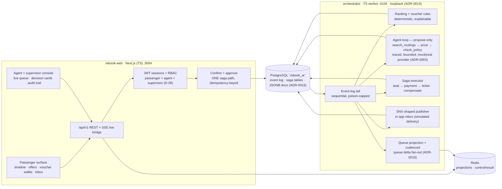

# Rebook.ai

**When a flight dies, the rebooking offer beats the passenger's question. And an AI agent does the legwork — a human still says yes.**

Rebook.ai is a two-sided passenger disruption concierge for the fictional carriers NX
NordicX, SV Sentosa Air and BH Blue Harbor Air: within seconds of a cancellation the
affected passengers have ranked rebooking options, an explainable voucher and an inbox
notification — and duty agents work a live, priority-sorted queue whose agentic
workflow (search routings → price → check policy) prepares decisions for human
approval. Fulfillment runs as a compensable saga with exactly-once steps.

> **Simulated data for portfolio purposes.** Every screen carries the disclaimer; the
> carriers, flights and bookings are fiction from birth. See
> [What is simulated](#what-is-simulated).

Built as the third project of an aviation-software portfolio
([repo overview](../../AGENTS.md)) — **two audiences, one codebase**: a tool passengers
and agents could actually use, and a readable, honest demonstration of
production-shaped engineering for hiring reviewers.

---

## The problem it demonstrates

IROPS days break the passenger experience in a specific way: information arrives late,
options are invisible, and every rebooking costs an agent queue minute. The defenses
are exactly what this project implements and measures:

1. **Proactive offers, ranked and explainable** — within seconds of the disruption
   event, every affected PNR holds fast/cheap/flexible options with per-rank reasons
   and policy caps; a long-haul cancellation auto-issues a voucher with its evaluated
   criteria trail (measured: `bench:rebook` p95 1.1 s at 1×; load report below).
2. **A live agent queue, not an inbox** — priority-sorted by tier/kind/SSR/wait,
   shrinking live as passengers self-serve; the containment metric counts only
   honest passenger confirms.
3. **An AI agent that proposes, never disposes** — the agent loop (mock LLM by
   default, provider-swappable) traces every tool call and token; nothing touches a
   booking until a human approves — and approval flows through the same saga path as
   a passenger tap. No side door.
4. **Exactly-one-effect fulfillment** — seat_reserve → payment → ticket_issue as
   compensable steps with per-step idempotency keys; N concurrent confirms (same or
   different keys) produce exactly one charge and one boarding pass, verified in the
   database, not from status codes.
5. **Honest failure handling** — an injected PSP decline unwinds the saga in reverse,
   reopens the offer and honestly returns the passenger to the queue; poison events
   surface in a supervisor view with attempts and error notes, never silently dropped.

## Architecture

Two surfaces, one worker, PostgreSQL as the queue of record
([ADR-0014](../../01-decisions/adr/ADR-0014-rebook-orchestrator-topology.md)): the
Next.js app owns identity, RBAC and REST; the TS orchestrator worker owns the scenario
clock, ranking, the agent loop, the saga executor and SNS-shaped notifications —
loopback-only, fed by the PostgreSQL event log and a Redis control channel.



**Trade-off story (each link is a decision, not a vibe):**

- **An orchestrator worker, not a queue product** —
  [ADR-0014](../../01-decisions/adr/ADR-0014-rebook-orchestrator-topology.md):
  PostgreSQL is the queue of record (event log + saga tables, the D-11 event-sourcing
  pattern); Redis stays a disposable projection. No Redis Streams, no broker, no
  Temporal — crash-safety comes from per-step idempotency keys and persisted step
  state, not from new infrastructure.
- **JSONB documents in PostgreSQL, not MongoDB** —
  [ADR-0015](../../01-decisions/adr/ADR-0015-rebook-jsonb-document-store.md): PNR
  documents, offer contexts, voucher criteria and proposal traces are genuinely
  document-shaped, so they live in JSONB with GIN indexes — one engine, one migration
  tool, and the exactly-once transactional invariant MongoDB-only would have lost.
- **A propose-only agent** — the PRD's hardest constraint (PRD F-5): the loop is
  bounded, traced and read-only; proposals are inert until a human approves, and
  approval applies through the same saga path as a passenger confirm. Provider is
  config, not code (ADR-0003 mock gateway): demos are offline-safe and the
  `source: llm | rules` / `provider` badges stay honest either way.
- **A coalesced queue projection** —
  [ADR-0016](../../01-decisions/adr/ADR-0016-rebook-queue-projection-coalescing.md),
  found by the F5 load runs: batched reads, batched per-event writes and a 250 ms
  fixed-interval rebuild keep the ×10 offer-pipeline gate honest without giving up the
  rebuild-from-PG correctness anchor.

## Feature status (F1–F5 done)

| Area | What works | Evidence |
|---|---|---|
| Disruption → offers | inject → notification + ranked offers p95 **1.1 s** at 1×; ranking deterministic (hash-asserted in CI) | `pnpm bench:rebook`, ranking tests |
| Live agent queue | priority-sorted snapshot + SSE `queue.delta`; rebuild-from-PG on flush; **p95 791 ms** append → frame | `pnpm bench:rebook-queue`, queue tests |
| Vouchers | explainable criteria (rule + met flag + evaluated detail), auto-issued on qualifying disruptions | voucher tests, passenger journey e2e |
| Agent loop | propose-only, tool trace + token usage persisted, `source`/`provider` honesty badges, supervisor gate for interline/over-cap | proposals integration suite, agent-flow e2e |
| Saga fulfillment | seat → payment → ticket, per-step idempotency, crash-safe resume, reverse compensation, boarding pass | saga integration suite, exactly-one-effect load verification |
| Concurrency | N-way confirm races produce exactly one effect (same-key replay, distinct-key 409) — verified in PG | `results/rebook/paced/effects-verification.txt` |
| Load evidence | ×10 scale (50 flights / 250 PNRs): paced offer p95 **9.7 s < 10 s** PASS; saturation burst honestly FAIL (14.9–19.6 s) with the fix story | [load report](../../04-projects/rebook-ai/load-report-f5.md) |
| Audit + ops | append-only decision trail ("who decided what for whom, when"), poison-event view, /healthz /readyz /metrics | audit integration tests, admin endpoints |

## JD mapping (SIA · Amadeus/SITA · CAG Commercial)

| Requirement | Where it lives |
|---|---|
| Customer-experience engineering under failure (SIA Senior Service Designer, CX) | proactive ranked offers + explainable vouchers within seconds of IROPS (PRD F-1/F-2/F-3), passenger timeline, honest containment metric |
| Event-driven architecture at travel-tech scale (SITA / Amadeus SWE) | PostgreSQL event log as queue of record + Redis projections + coalesced fan-out (ADR-0014/0016), additive event vocabulary in `packages/contracts` |
| Distributed-transaction / reliability instincts (SITA / Amadeus) | compensable saga with per-step idempotency, crash-safe resume, exactly-one-effect under N-way concurrency — verified in the database, not from status codes (api-contracts §5, load report) |
| React/Next.js + REST + SQL or NoSQL (CAG Req 7133, Commercial) | Next.js 15 App Router surfaces + versioned `/api/v1` REST + document-shaped JSONB with GIN indexes in PostgreSQL (ADR-0015) |
| AWS-shaped services: SNS/SQS, Lambda, DynamoDB (CAG Req 7133) | SNS-shaped notification publisher (drop-in swap for a real client), loopback worker = Fargate-shaped service, JSONB ≈ DynamoDB trade-off written down in ADR-0015 |
| GenAI: AI agents, tool use, guardrails, human-in-the-loop (CAG Req 7133) | propose-only agent loop with bounded rounds, traced tool calls, human approval through the one saga path, `source`/`provider` disclosure (ADR-0003) |
| AI-app reliability: observability, degradation (CAG Req 7133) | /healthz /readyz /metrics on both services, degrade-to-rules agent labeled end-to-end, poison-event surfacing, structured request logs |
| AuthN/AuthZ + idempotent APIs (CAG Req 7133) | JWT sessions + role ladder (passenger < agent < supervisor), required Idempotency-Key with PG replay store, ownership-scoped reads |
| CI/CD + load evidence (CAG Req 7133, engineering standards) | GitHub Actions `rebook.yml` (compose smoke + integration) + `ci.yml` (lint/typecheck/unit/build); k6 ×10 load harness with committed evidence |

## What is simulated

Binding rules: [data-ethics.md](../../02-standards/data-ethics.md) and D-07.

- **Carriers and schedule** — NX NordicX, SV Sentosa Air, BH Blue Harbor Air are
  fictional; the reference day (120 flights, 41 PNR-like bookings) is a hand-written
  synthetic scenario. No real airline, airport or PNR data anywhere.
- **Payments and inventory** — the PSP is a deterministic stub (`PSP_DECLINED` on the
  documented `simulateFailure` marker); seat inventory is a DB counter decremented by
  the saga. No money moves.
- **Notifications** — SNS-shaped and delivered to an in-app inbox marked
  `delivered` (simulated delivery states shown honestly); no email/SMS/push.
- **The agent's LLM** — the mock gateway by default (ADR-0003): deterministic,
  offline-safe, cost-zero; a real provider is configuration, and the UI badges say
  which is live.
- **Users** — three seeded demo accounts (below), fake from birth; no registration.
- Every screen carries a persistent "Simulated data for portfolio purposes" footer;
  load numbers in this README are reproducible from committed scripts (no invented
  claims — data-ethics.md §4).

## Quickstart (clean clone)

```bash
pnpm install
docker compose --profile rebook up -d      # web :3004 (self-builds, seeds, serves) + orchestrator :4104
```

Open **http://localhost:3004** and sign in with a seeded demo account:

| Role | Email | Password |
|---|---|---|
| passenger | `nadia.cho@pax-sim.example` | `passenger-nx-01` |
| agent | `amir.hassan@nx-sim.example` | `agent-nx-01` |
| supervisor | `grace.tan@nx-sim.example` | `supervisor-nx-01` |

Demo beat (90 s script: [demo-script.md](../../04-projects/rebook-ai/demo-script.md)):
sign in as the supervisor → inject a `cancellation` on NX 288 → the agent queue fills,
Nadia's inbox receives the notification with three ranked offers and a voucher →
confirm as Nadia → watch the saga land seat → payment → ticket and the boarding pass.

Readiness: `curl localhost:3004/healthz`, `curl localhost:3004/readyz`,
`curl localhost:4104/healthz`, `curl localhost:4104/readyz`. Teardown:
`docker compose --profile rebook down` (add `-v` to reset the reference day).

## Host-side development (without the containerized web)

```bash
cp .env.example .env                       # AUTH_SECRET required (dev throwaway ok)
docker compose --profile infra up -d       # postgres :5433 + redis
pnpm seed:rebook                           # ensure rebook_ai DB + migrations + users
pnpm --filter rebook-ai dev                # web on :3004
pnpm --filter @aviation/rb-orchestrator dev # orchestrator on :4104
```

## Checks

```bash
pnpm lint                                   # prettier + eslint, zero warnings
pnpm typecheck                              # strict tsc across the workspace
pnpm test                                   # vitest unit (contracts, auth, orchestrator domain)
pnpm --filter rebook-ai test:integration    # needs the rebook compose stack
pnpm --filter @aviation/rb-orchestrator test:integration
pnpm test:e2e:rebook                        # Playwright: fresh stack (down -v first)
pnpm bench:rebook && pnpm bench:rebook-queue
pnpm loadtest:rebook                        # ×10 load evidence (see load report)
```

## Documentation

- Project docs: [PRD](../../04-projects/rebook-ai/PRD.md) ·
  [architecture](../../04-projects/rebook-ai/architecture.md) ·
  [data model](../../04-projects/rebook-ai/data-model.md) ·
  [API contracts](../../04-projects/rebook-ai/api-contracts.md) ·
  [milestones](../../04-projects/rebook-ai/milestones.md)
- Evidence: [load report](../../04-projects/rebook-ai/load-report-f5.md) ·
  milestone reports F0–F5 in the same directory
- Decisions: [ADR-0014](../../01-decisions/adr/ADR-0014-rebook-orchestrator-topology.md) ·
  [ADR-0015](../../01-decisions/adr/ADR-0015-rebook-jsonb-document-store.md) ·
  [ADR-0016](../../01-decisions/adr/ADR-0016-rebook-queue-projection-coalescing.md) ·
  [decision log](../../01-decisions/decision-log.md)
- Standards: [design system](../../02-standards/ui-design-system.md) ·
  [data ethics](../../02-standards/data-ethics.md) ·
  [tech stack](../../03-platform/tech-stack.md)
