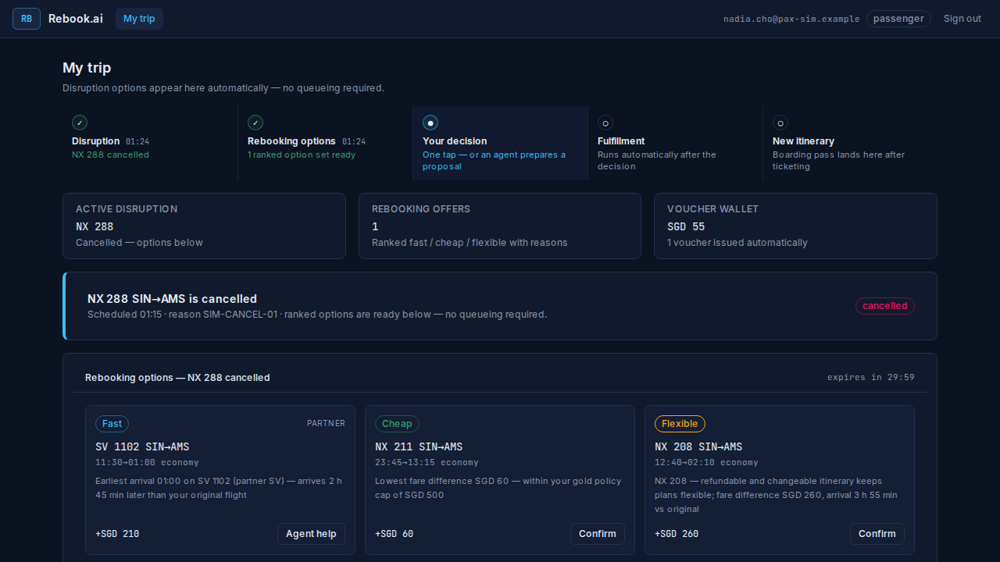
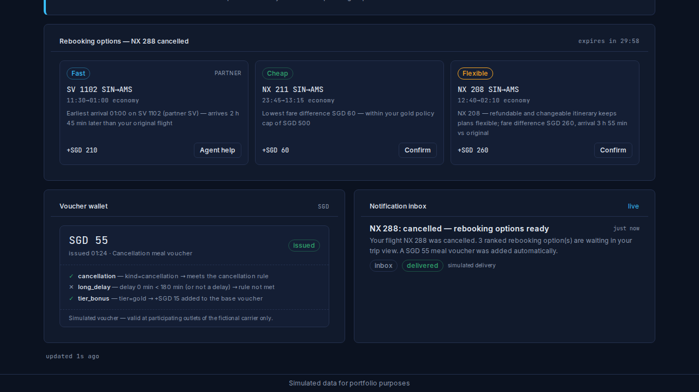
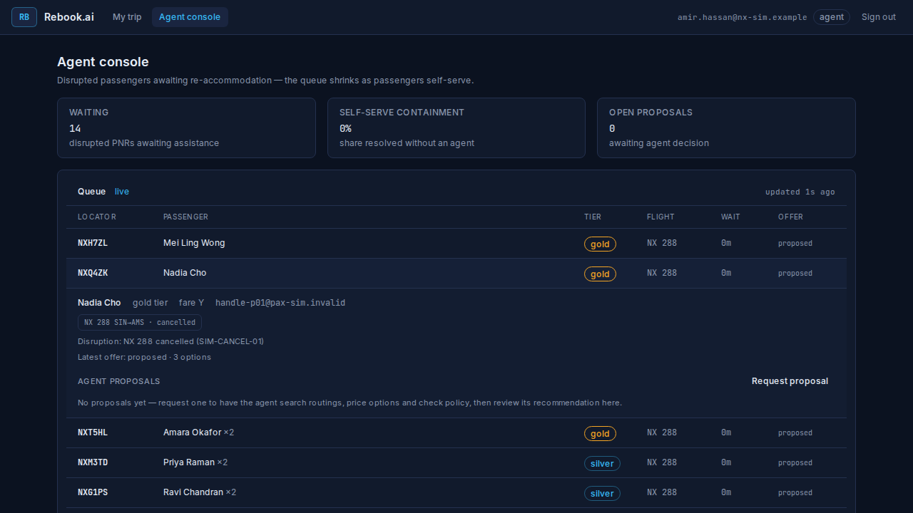
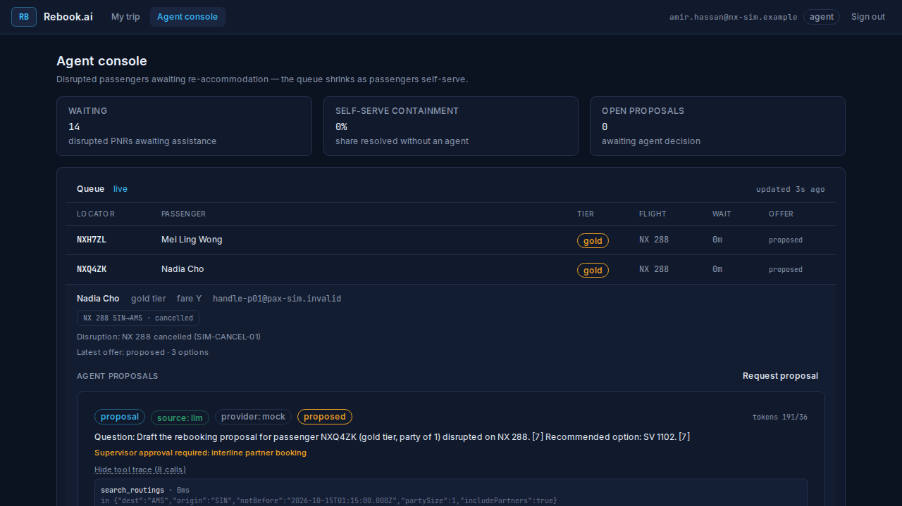
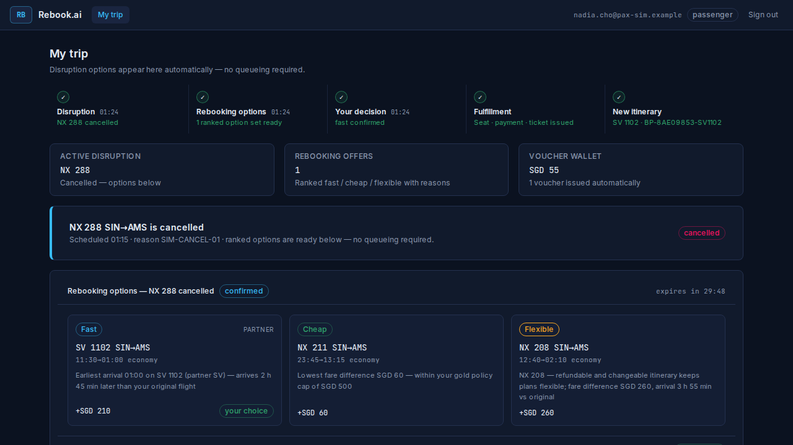
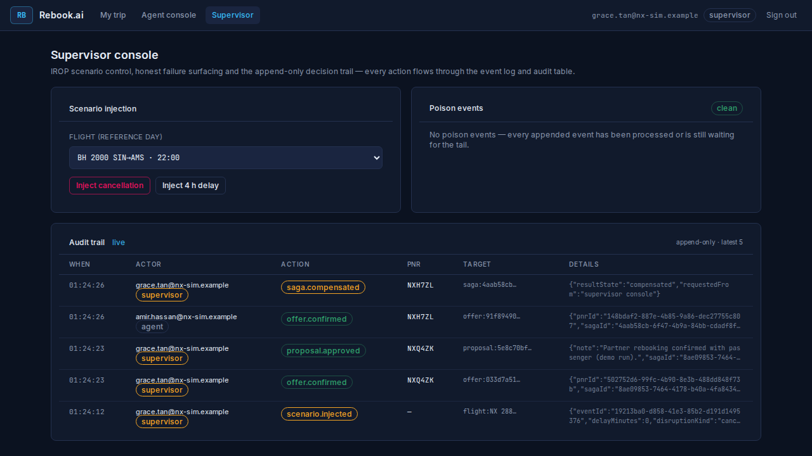
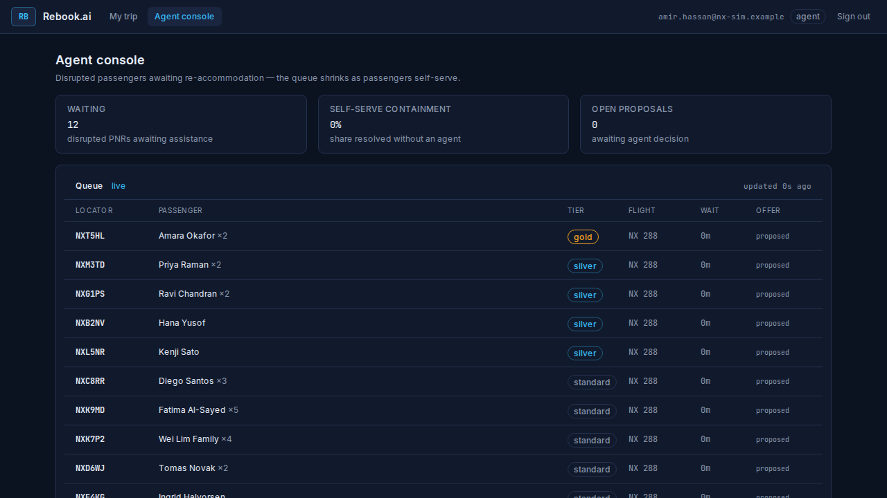
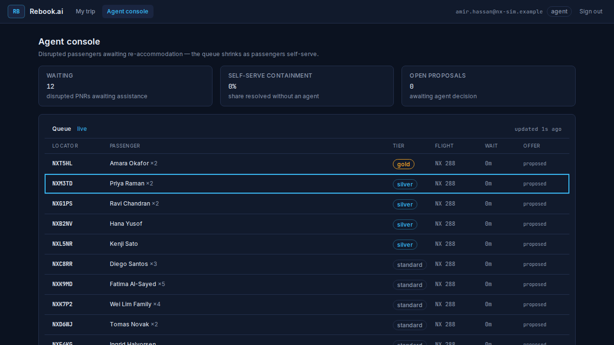
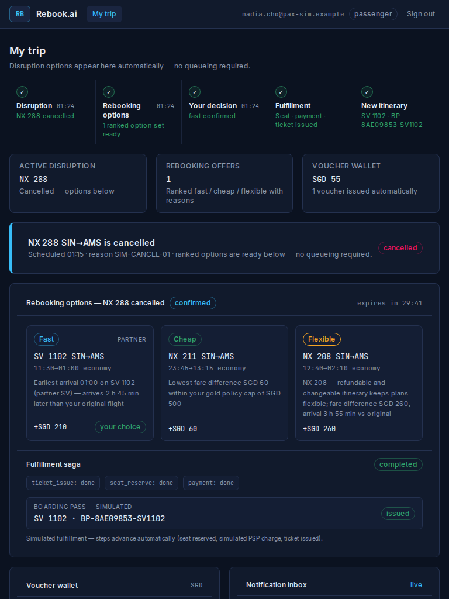

# Rebook.ai — Continuous F-1…F-7 Demo Run (F4)

| Field | Value |
|---|---|
| Date | 2026-09-27 |
| Scope | milestones.md F4 DoD: all PRD in-scope features demonstrable in one continuous run |
| Harness | `apps/rebook-ai/scripts/capture-ui-review.mjs` on a fresh stack (`down -v` → `up -d --wait`) |
| Cast | Nadia Cho NXQ4ZK (NX 288 SIN→AMS cancelled), Amir Hassan (agent), Grace Tan (supervisor) — demo-script.md |

## Beat log

1. F-1/F-4: supervisor injected cancellation on NX 288 — event appended, orchestrator pipeline notified
2. F-2/F-7: interline `fast` option honestly gated for the passenger (agent/supervisor path)
3. F-5: agent loop produced a traced, badged proposal (propose-only, deterministic mock provider)
4. F-6/F-7: supervisor approval applied through the ONE saga path (audit row + proposal.approved)
5. F-6: saga completed seat_reserve → payment (simulated PSP) → ticket_issue; boarding pass BP-… issued
6. F-6 honesty beat: saga 4aab58cb… compensated (compensated) — NXH7ZL returns to the queue
7. F-4 containment tile: waiting=12 containment=0% (honest, live from PG)

## Screenshots (assets/)

-  — Supervisor console — scenario control, honest empty audit trail + clean poison panel (§7 states)
-  — Passenger trip — journey timeline, disruption banner, 3 ranked offers with reasons (F-1/F-2)
-  — Voucher wallet with explainable criteria + inbox with simulated delivery state (F-3)
-  — Agent console — KPI tiles, priority queue, expanded booking context (F-4)
-  — Proposal decision card — source/provider honesty badges, tool trace, supervisor gate (F-5)
-  — Journey settled — new itinerary + boarding pass labeled simulated (F-6)
-  — Audit trail — who decided what for whom, when (F-7, demo beat 80–90 s)
-  — Agent queue after service + compensation — containment tile, re-queued passenger (F-4)
-  — Keyboard navigation — roving focus + visible focus ring on queue rows (§9)
-  — Responsive smoke — passenger trip at 768×1024 (§8: responsive is not an afterthought)

All numbers and states above are read from the running stack — nothing fabricated (data-ethics.md §4).
