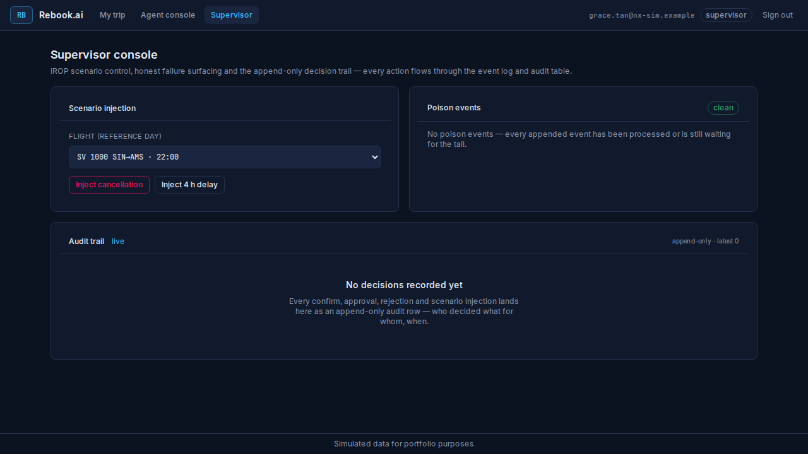
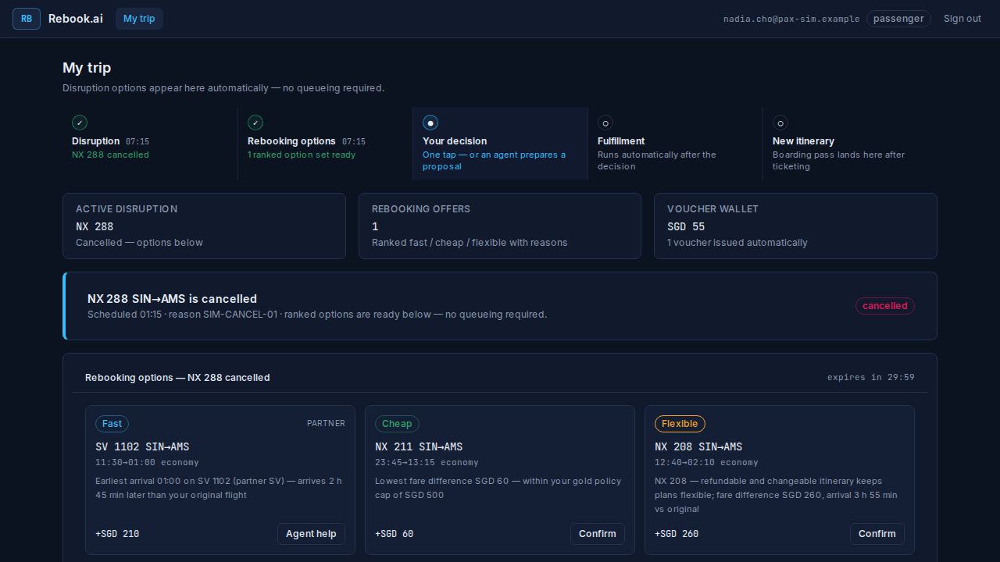
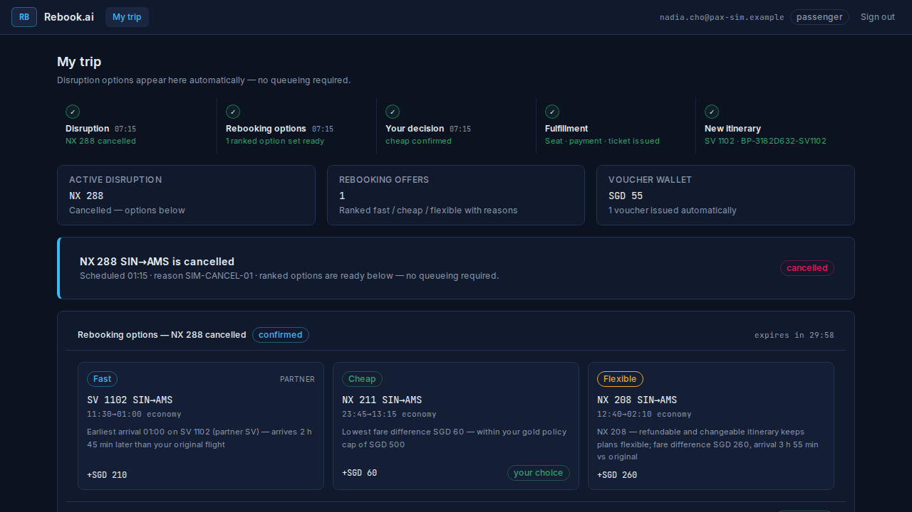
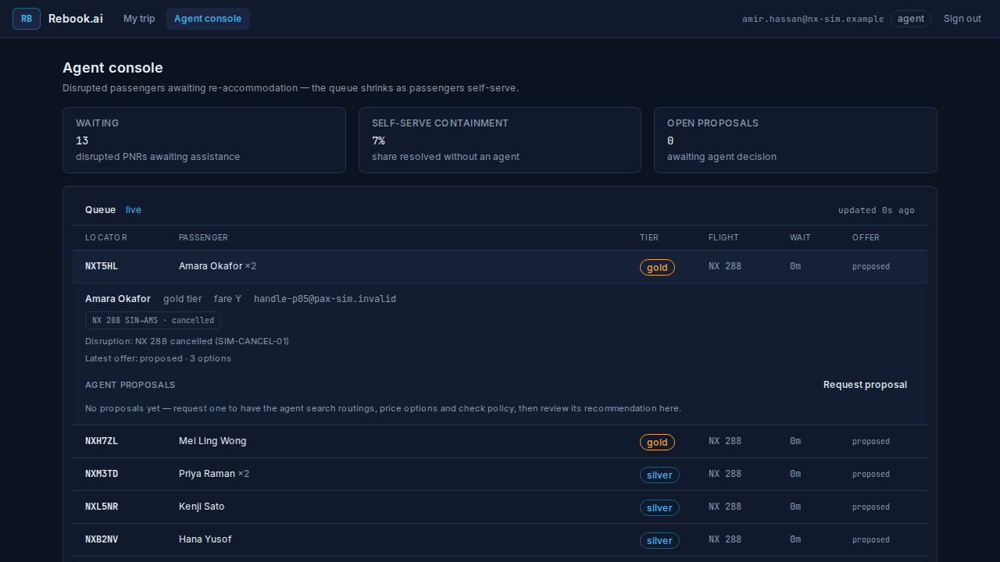
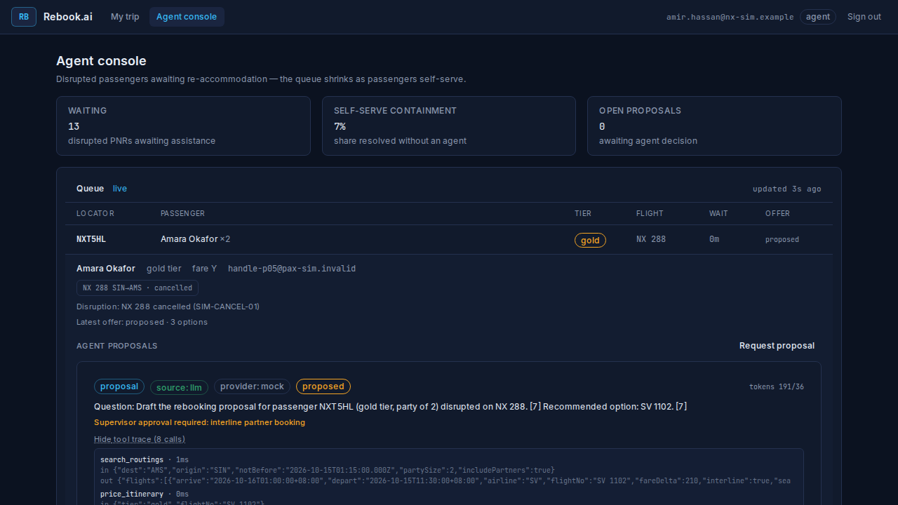
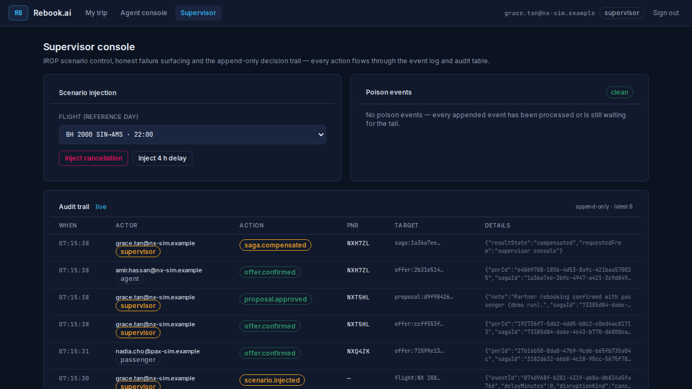
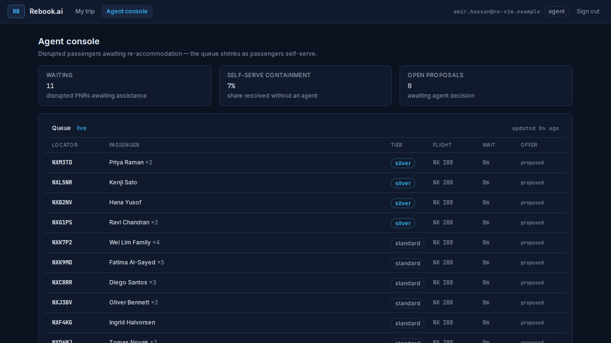
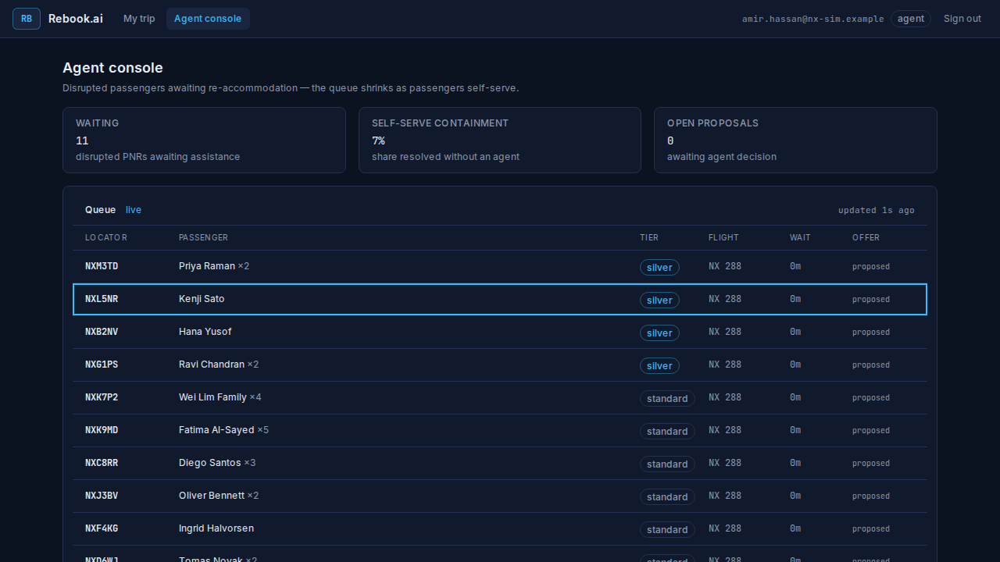
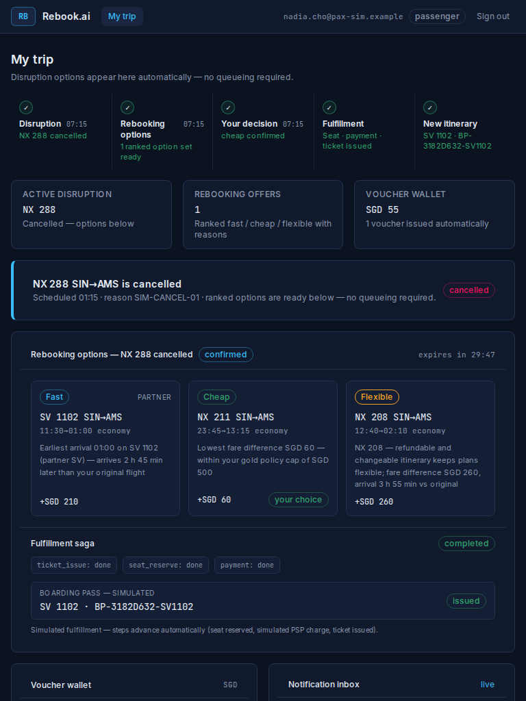

# Rebook.ai — Continuous F-1…F-7 Demo Run (F5)

| Field | Value |
|---|---|
| Date | 2026-09-27 |
| Scope | milestones.md F5 DoD: the demo-script.md 90 s beat sheet executed on a fresh stack (video recording itself = human step, flagged not faked) |
| Harness | `apps/rebook-ai/scripts/capture-demo-f5.mjs` on a fresh stack (`down -v` → `up -d --wait`) |
| Cast | Nadia Cho NXQ4ZK (NX 288 SIN→AMS cancelled), Amir Hassan (agent), Grace Tan (supervisor) — demo-script.md |
| F4-handoff beat | passenger SELF-SERVES the same-carrier option → containment > 0% |

## Beat log (wall clock from run start)

1. [21.9 s] beat 0–8 s: cancellation injected on NX 288 (proactive pipeline notified)
2. [23.1 s] beat 8–20 s: notification + 3 ranked offers + voucher visible for NXQ4ZK
3. [23.6 s] beat 20–30 s: passenger confirmed the cheap option — saga opened (self-serve)
4. [24.2 s] beat 30–50 s: saga landed seat_reserve → payment (simulated PSP) → ticket_issue; boarding pass issued to the PASSENGER (containment beat)
5. [28.6 s] beat 30–50 s: agent loop produced a traced proposal for NXT5HL (propose-only)
6. [29.9 s] beat 50–70 s: supervisor approval applied through the ONE saga path (no side door)
7. [30.4 s] beat 70–80 s: saga 1a36a7ee… compensated (compensated) — NXH7ZL honestly back in the queue
8. [32.9 s] beat 80–90 s: queue waiting=11, containment=7% (self-serve NXQ4ZK confirmed → > 0%)
9. [34.8 s] total wall clock for the full beat sheet (fresh stack, real pipeline)

## Screenshots (assets/)

-  — Supervisor console — scenario control, empty audit trail + clean poison panel
-  — Passenger trip — timeline, disruption banner, 3 ranked offers with reasons
-  — One-tap self-serve confirm on the same-carrier option (no agent queue minute spent)
-  — Saga completed live — new itinerary + boarding pass, labeled simulated
-  — Agent console — live queue (NXQ4ZK already served), NXT5HL expanded
-  — Traced, badged proposal (source: llm / provider: mock) — propose-only until approved
-  — Audit trail — who decided what for whom, when (demo beat 80–90 s)
-  — Containment tile above 0% thanks to the passenger self-serve confirm + re-queued compensation passenger
-  — Keyboard navigation — roving focus + visible focus ring on queue rows (§9)
-  — Responsive smoke — passenger trip (settled itinerary) at 768×1024

## Honesty notes (data-ethics.md)

- Every number here was read from the running stack; no metric is invented.
- The LLM beat runs on the deterministic mock provider; the badge says so.
- The compensation beat is the manual supervisor compensate (audited); the
  deterministic injected failure (`simulateFailure`) stays orchestrator-internal
  and is covered by the saga integration suite.
