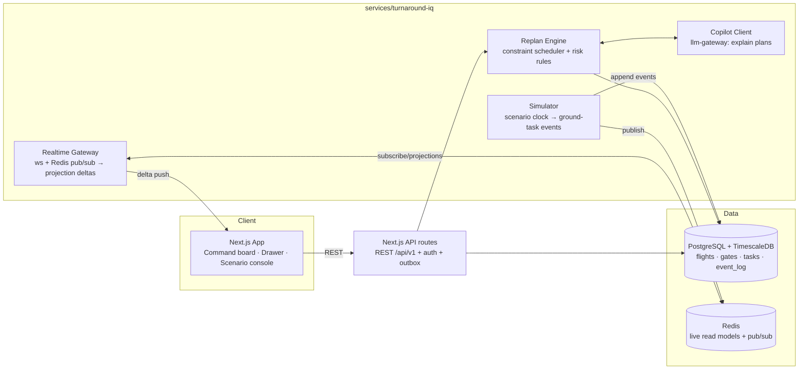

# TurnaroundIQ — Architecture

| Field | Value |
|---|---|
| Status | Approved |
| Decisions applied | ADR-0001 (event sourcing), ADR-0002 (PostgreSQL), ADR-0003 (LLM gateway), D-09 (auth) |

## 1. System Overview

## 2. Component Responsibilities

| Component | Owns | Must NOT |
|---|---|---|
| `apps/turnaround-iq` (Next.js) | UI, REST `/api/v1`, session auth, write path → PostgreSQL via outbox | compute schedules; mutate projections directly |
| `services/turnaround-iq/simulator` | scenario clock, ground-task event generation, disruption injection | read UI state; talk to clients |
| `services/turnaround-iq/realtime-gateway` | ws sessions, subscribe/publish deltas, presence | business logic; direct DB writes |
| `services/turnaround-iq/replan-engine` | risk rules (F-3), constraint scheduler (F-4), replan proposals as events | touch Redis reads for decisions (source of truth = PG event log) |
| copilot client | natural-language explanation of proposals via llm-gateway; mock provider default | decide schedules (explain-only, PRD F-4) |

## 3. Event Flow (happy path)

1. Scenario starts → simulator writes `turn.started` + initial task events to `event_log` (monotonic `sequence` per flight aggregate), publishes to Redis.
2. Projection worker (inside realtime-gateway) consumes new events idempotently (`sequence > last_applied`), updates Redis read models, broadcasts deltas on ws channels `flight:{id}` and `board:summary`.
3. UI applies deltas → board updates (< 1 s p95).
4. Risk rules evaluate projections on each relevant event → `alert.raised` events (audit-complete).
5. Coordinator triggers replan → REST → replan-engine reads event log, computes plan, emits `replan.proposed` → UI shows diff → coordinator approves → `replan.approved` → simulator adopts new schedule → task events continue.

## 4. Realtime & Consistency

- Transport: ws (binary off, JSON envelopes), reconnect with backoff + `Last-Event-Id` catch-up via REST snapshot + missed events replay.
- Redis is a **cache/projection layer**, never the source of truth. Rebuild = replay `event_log`.
- Clocks: simulator owns scenario time (`scenario.now`); all SLA math uses scenario time, serialized in events — no client wall-clock math.

## 5. AuthN / AuthZ (D-09)

- Seeded users (passwords hashed with argon2id); JWT session cookie (httpOnly, SameSite=Lax).
- Interface: `AuthProvider { signIn, verify, getUser }` — Cognito-shaped for swap.
- Roles: `viewer` < `coordinator` < `supervisor` (PRD F-7). Authorization checked in API route handlers server-side per action, middleware only guards routes.
- WS auth: short-lived signed token query param at upgrade; rejected → close 4001.

## 6. Failure Handling

| Failure | Behavior |
|---|---|
| Simulator crash | events durable in PG; restart resumes at last sequence, scenario clock resyncs |
| Duplicate event delivery | idempotency via per-aggregate `sequence` + handler `applied_events` table |
| Gateway overload | per-channel delta coalescing (≤ 10 Hz per client), backpressure drops oldest deltas (catch-up path exists) |
| LLM unavailable | copilot returns template explanation, UI labels source "rules engine" (ADR-0003) |
| Replan infeasible | engine returns partial plan + unresolvable conflicts, never silently violates constraints |

## 7. Observability (F5 evidence)

- pino JSON logs with `requestId`/`eventId` propagation; metrics: `event_ingest_latency`, `projection_lag`, `ws_clients`, `replan_duration_ms`, `alert_lead_time`; Grafana dashboard committed at `infra/observability/`.
- `/healthz` + `/readyz` on every service.

## 8. Deployment Shape

- Local: compose profile `turnaround` (see monorepo-architecture.md §3).
- Public demo (F5): web on Vercel; services on single VM/Fly.io; managed Postgres/Redis or containerized on the VM.
- AWS mapping: tech-stack.md §2 (narrative + IaC-ready `infra/turnaround-iq/`).
