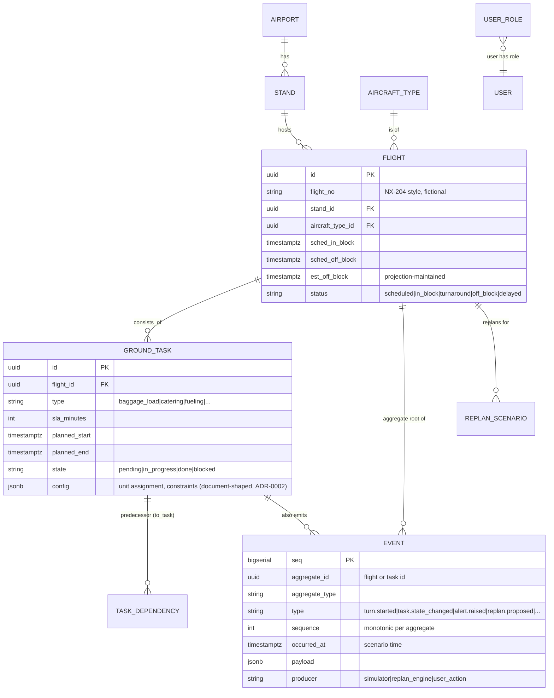

# TurnaroundIQ — Data Model

| Field | Value |
|---|---|
| Status | Approved |
| Store | PostgreSQL 16 + TimescaleDB (ADR-0002); Redis = projection cache only |

## 1. ERD (core)

## 2. Table Notes

| Table | Key columns & rules |
|---|---|
| `stands` | code (`A1`…), type (narrow/wide), constraints JSONB (max wingspan, fuel availability) |
| `aircraft_types` | code (`NB320`), turn SLA defaults JSONB |
| `flights` | `est_off_block` is a **projection** — rebuilt from events, never hand-edited; unique `(flight_no, sched_in_block)` |
| `ground_tasks` | `state` is projection; `config` holds document-shaped data (unit assignments, constraint hints) — the ADR-0002 story |
| `task_dependencies` | `(task_id, predecessor_task_id)`, cycle-checked at insert |
| `events` (event_log) | append-only; PK `seq`; index `(aggregate_id, sequence)` unique — the idempotency key (ADR-0001); no UPDATE/DELETE grants to app role |
| `applied_events` | `(aggregate_id, last_sequence)` per consumer — projection watermark |
| `replan_scenarios` | proposal diff JSONB, status (`proposed|approved|rejected`), computed_at, cost breakdown |
| `alerts` | lifecycle state machine `raised → acknowledged → resolved`, derived from `alert.*` events |
| `users` / `roles` | argon2id password hash; role enum per D-09 |
| `task_telemetry` (TimescaleDB hypertable) | per-task progress samples from simulator; compression after 7 days (realism + TSDB story) |

## 3. Redis Key Design

| Key | Type | Content |
|---|---|---|
| `proj:flight:{id}` | hash | current flight + task projection (read model for API/WS) |
| `proj:board:summary` | hash | KPI strip aggregates (per PRD F-6) |
| `chan:flight:{id}` / `chan:board` | pub/sub | delta envelopes (contracts §events) |
| `ws:session:{connId}` | hash | Last-Event-Id per client for catch-up |

## 4. Retention & Volumes

- Scenario scale: ~60 flights/day, ~12 tasks/turn → ~720 tasks, ~15k events/scenario-day. Trivial for PG; honest load test target scales ×10 (engineering-standards §3).
- `events` retention: full log kept (audit is a feature); `task_telemetry` compressed per Timescale policy.
- Migrations via drizzle-kit; seed data in `apps/turnaround-iq/seed/` — one canonical "reference day" + 3 disruption scripts (PRD F-5).
